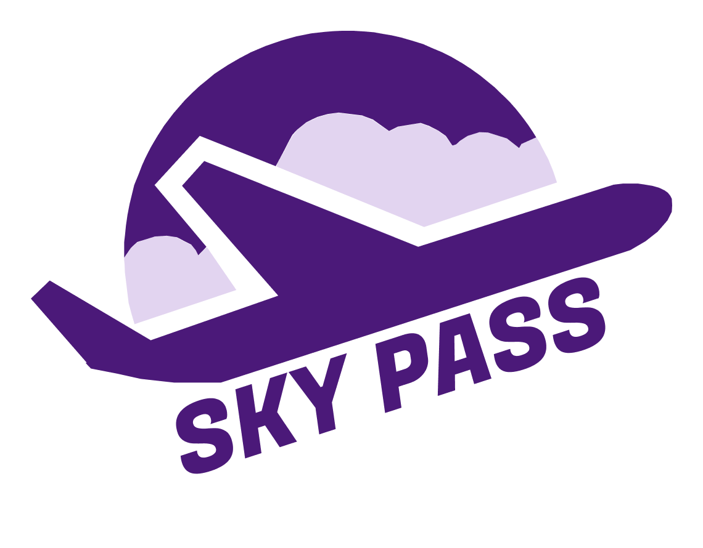
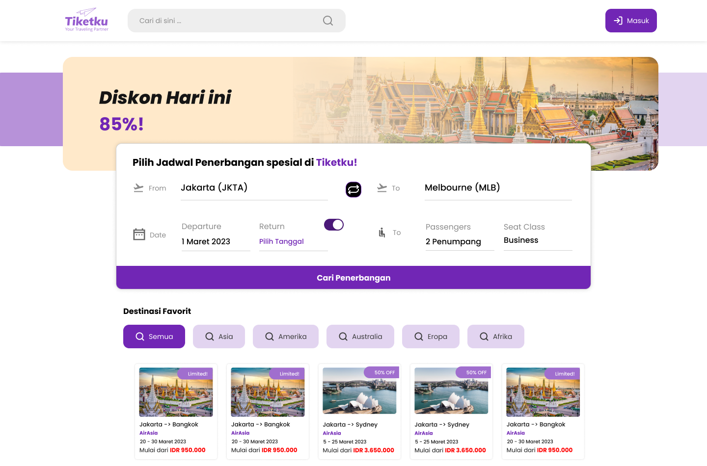
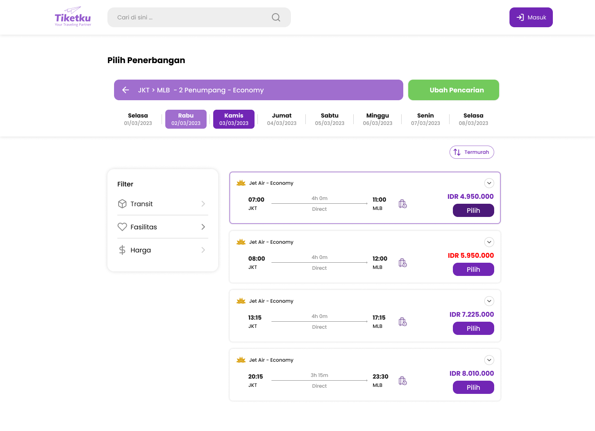

<h1 align="center">
  
  <br/>
  Finaltask Binar Academy Frontend Skypass
</h1>

<p align="center">
 <a href="https://kelompok3-frontend-final-project.vercel.app/" target="blank">
  
 </a>
 <a href="https://daisyui.com/" target="_blank">
  
 </a>
 <a href="https://tailwindcss.com/docs/guides/vite#react" target="_blank">
  
 </a>
 <a href="https://www.w3schools.com/js/" target="_blank">
  
 </a> 
 <a href="https://www.w3schools.com/js/" target="_blank">
  
 </a> 
 <a href="https://nodejs.org/en" target="_blank">
  
  </a> 
 <a href="https://vercel.com/" target="_blank">
  
  </a> 
 <a href="https://github.com/" target="_blank">
  
  </a> 
</p>

## Project

SkyPass is a project aimed at providing a user-friendly platform for booking airline tickets efficiently. Leveraging cutting-edge technology in travel industry, our goal is to offer a seamless and enjoyable user experience for planning air travel. We will endeavor to enhance our service by providing comprehensive airline comparisons in the future. SkyPass is committed to delivering an efficient and reliable experience for users when planning their travels.

[Deployed Website Link 🚀🚀](https://kelompok3-frontend-final-project.vercel.app/)

## Setup

#### 1. Node.js

To install all packages listed in your package.json file, use the following command:

```
npm install
```

#### 2. Running The Code

To run the code, you can use the following command:

```
npm run dev
```

To view the interface, you can use the following link:

```
http://localhost:5173
```

## Endpoint

### WEB

| Endpoint | Deskripsi          | Example                      |
| -------- | ------------------ | ---------------------------- |
| /        | Homepage           | http://localhost:5173        |
| /search  | Search Ticket Page | http://localhost:5173/search |

<h1 align="center">
    Project Preview 📸
    <hr>
</h1>




# React + Vite

This template provides a minimal setup to get React working in Vite with HMR and some ESLint rules.

Currently, two official plugins are available:

- [@vitejs/plugin-react](https://github.com/vitejs/vite-plugin-react/blob/main/packages/plugin-react/README.md) uses [Babel](https://babeljs.io/) for Fast Refresh
- [@vitejs/plugin-react-swc](https://github.com/vitejs/vite-plugin-react-swc) uses [SWC](https://swc.rs/) for Fast Refresh
